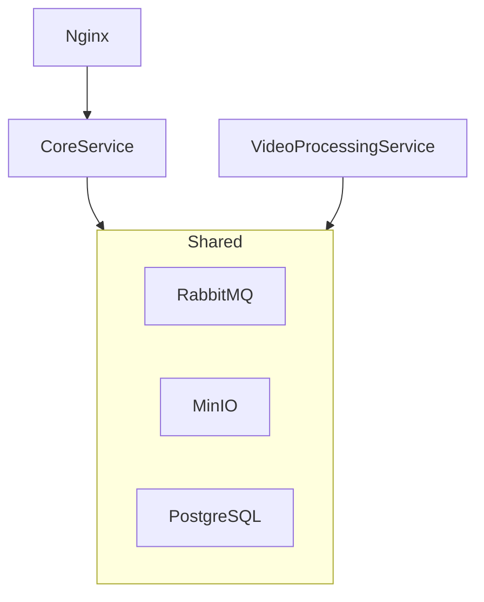

# VideoService

ремейк [старого вузовского проекта](https://github.com/MaxaiZer/NSTU_Programming/tree/main/semester8/movie-theater-backend)

по сути, гипер упрощённая версия ютуба

## Сервисы

### 1. **CoreService (Монолит)**
Отвечает за управление пользователями и метаданными видео.

### 2. **VideoProcessingService (Микросервис)**
Конвертирует видео в HLS (HTTP Live Streaming) с помощью FFmpeg для потоковой передачи.

## Диаграмма

P.S. используется локальный nuget пакет с клиентом  для MinIO (с исправленным багом из 6.0.3), т.к. там долго не аппрувят критические пр'ы
